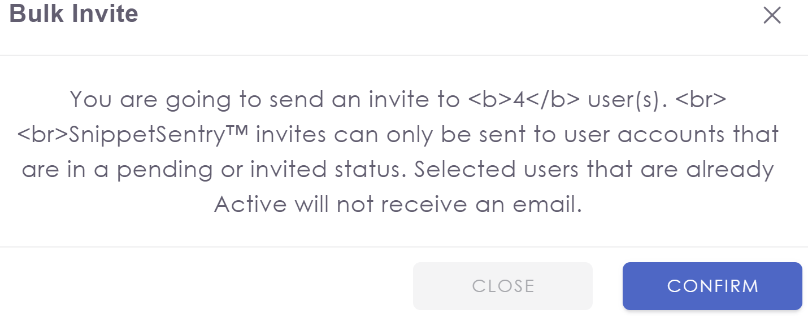

# snippetsentry

## 0. Before I Begin

### 0.1. Signup
Signup has a small UX problem.

On the password setup screen (https://beta.snippetsentry.com/accept-invitation?email_token=01JTXVKYT0SY1BDWT3HKFT0SF0-01JTXVKYT0GMQSGC9YF0TDE07K), the form's submit button is active even before filling all fields.

Clicking it  . . .

expected: should not be possible (grayed out, inactive button)

actual: UI scolds me with red text

## 1. Exploratory

[Exploratory testing](https://www.qualitestgroup.com/insights/blog/agile-testing-and-exploratory-testing/) does not follow plans or cases. [I typically start with a written charter](https://github.com/drewcoo/test_thoughts/blob/main/published/rigorous-ish_exploratory_testing.md) and touching base with stakeholders so that everyone knows where I'm exploring, what the purpose is, and what the timebox is. Then I head out and take notes along the way about what I do, anything strange I find, and possible directions to explore later. Afterward, I debrief with stakeholders, find out which of the strange things were bugs (and file bugs), and generally share what I found.

Exploratory testing is all manual or manual probing assisted by tools.

But you've asked for [a plan](https://github.com/drewcoo/test_thoughts/blob/main/published/test_plan_template.md) and cases, which are a completely different style of thing. And my usual charter/explore/debrief MO doesn't quite fit with a take-home assignment.

Why don't I just have a poke-around, take some notes I can share here, then give you cases for a subset of the Users functionality? I can wrap those in some general test plan scaffolding with lots of TODOs.

### 1.1. ET Notes

#### 1.1.1. General Button UX

##### 1.1.1.1. Gray Buttons

I would expect a gray button to be inactive. Throughout the UI, gray buttons are active.

It is more difficult to read gray buttons' labels, so if they're intended to be active, the color scheme should change.

##### 1.1.1.2. Blue/Green Buttons

There are blue buttons and there are green buttons. I'm not sure I understand the difference in functionality.

If blue and green are intended to be different, there may be UX problems for [colorblind folks](https://www.allaboutvision.com/conditions/color-blindness/tritanopia/).

I commonly see status UI using blue/red for pass/fail, if that helps.

#### 1.1.2. Internationalization

Many things are not translated into French and Arabic. Were they supposed to be or is that a work in progress?

#### 1.1.3. Profile

##### 1.1.3.1. Misspelled "Log out"

There's a "log out" link (misspelled as "Logout") in the dropdown when I try to select my profile.

##### 1.1.3.2. Can't View/Edit Profile

I don't see a way to view or edit the profile through the profile Gravitar dropdown menu from the header. I have to click the link on the name in the user list to do that.

##### 1.1.3.3. Can't Set Gravitar

I have the default Fischer-Price person image and can't swap it out with anything more atttractive.

#### 1.1.4. Add User

##### 1.1.4.1. New User

|admin?|send email?|first name|last name|email|ph|notes|result|
|---|---|---|---|---|---|---|---|
|N|N|foo|bar|foo@bar.baz||first one|added|
|N|N|foo|bar|foo@bar.baz||second one|email collision[1][2]|
|N|N|foo|bar|foo1@bar.baz||different email|added - name collisions are no problem|
|N|Y|foo|bar|drewcoo+1@gmail.com||different email|added and sent email but I think I needed to log out or clear my cookies - collision with existing logged-in session|
|N|N|<project Gutenberg>|<project Gutenberg>||||name must be < 255 chars|
|N|N|foo|bar|drewcoo+<200 Xs>@gmail.com||long email address|"Invalid params provided. \"email\" must be a valid email (actual value=\"blahblahblah"\)[3][4]|

[1] Adding a user with an email collision throws an error. Is that true only for users I can see or also users added to the system in some other way? As part of another company?

[2] Call to AuthzAddUser returns AuthzEmailBusy and a 200! An error is not success.

[3] Could not tell how long it would allow. Error message didn't tell me how long either.

[4] Error msg too big for popup - could not all be displayed. I know I saw that problem elsewhere, too, depending the viewport size I was using and sometimes notS, too.

#### 1.1.5. Edit User

Edit user and hitting save way at the bottom of the pane pops green UI with a progress bar - yuck!

|admin?|send email?|first name|last name|email|ph|notes|result|
|---|---|---|---|---|---|---|---|
|N|N|foo|bar|foo@bar.baz|-> 2065472249||modified|
|N|N|foo|bar|foo1@bar.baz|-> 2065472249||modified - apparently phone numbers are not unique|
|N|N|foo|bar|foo@bar.baz -> drewcoo+1@gmail.com|2065472249||**cannot edit email field!**|
|N -> Y|N|foo|bar|foo@bar.baz|2065472249||**Warns in red "This will update user's permission." Should be plural. Should not scold me. **|

**I did not try deleting my own user because I was afraid I'd mess it up and lock myself out of the system. That should be on one of these lists, though.

##### 1.1.5.1. Add Android

###### 1.1.5.1.1. Country Code

Text says "If you are outside the US, please use full international format: +14155551212" but dropdown for country includes country code.

Then the UI said it was texting me but the spinner spun and spun . . . it feels like there should have been a reasonable timeout. Maybe an immediate timeout if the back end was expecting an Asterix server or something and didn't find one.

Finally. Finally the UI popped an error for me that I didn't manage to copy/paste. Ah - here it was in the console log: "Request is timed out when call 'agent.connectUserToChannel' action on 'null' node."

Which makes me wonder what all has spinners and why. Spinners are a band-aid over bad UX.

##### 1.1.5.2. WhatsApp

Don't currently have it installed.

##### 1.1.5.3. iMessage

Don't currently have it installed.

#### 1.1.6. Bulk Upload

|file type|result|
|---|---|
|empty csv|"The csv file provided contained no data" **(no period)**|
|empty file|"The csv file provided contained no data." **(period)**|
|existing user|"1 existing user email(s) found in the database. Please check the attachment sent via email for more details."  **email collision**|
|

I need to upload longer lists of users. I need to figure out how CSVs are being handled in the code and see if that could knock a server over.

#### 1.1.7. Bulk Invite

|selected|button enabled?|results|
|---|---|---|
|nothing|Y|If I click it, it scolds me.|
|all|Y|bad UI, then it invites[1]|

[1] The UI looks like this:

Note that it:
- has HTML markup visible  in the UI,
- tells me how many total users are selected and not how many will be invited,
- has a grayed out "CLOSE" button that is actually an active button,
- and has no other functionality for multi-selecting from the list except bulk invite

Who uses this and how?

#### 1.1.8 Export

#### 1.1.9. Clear Filters

#### 1.1.10. Select User Status

#### 1.1.11. Select Channel Status

I don't have any users on channels.

#### 1.1.12. Select Channel

I don't have any users on channels.

-----

At this point, I feel like I've sunk too much time into writing up ET. This is roughly organized as a test plan and even includes some things that can double as test cases for scripted testing. [An actual test plan](https://github.com/drewcoo/test_thoughts/blob/main/published/test_plan_template.md)(dup of earlier link to test plan template) would include a lot more depth. It would also lump things into [scope of tests (e2e, component, other?)](https://github.com/drewcoo/test_thoughts/blob/main/published/test_pyramid.md) for a given concern. The three things I think the product needs the most work on are, from most embarrassing to least:
- usability (buttons and popups first, then organization - how have usability studies gone?),
- performance (and getting rid of spinners and progress bars),
- and i18n (given that anyone can click on something to change languages and see that it's half-baked).

## 2. UI automation

Generally UI automation should not try to imitate manual cases. As an analogy, most weeks, I go to the library. When I walk I take one route. When go by I car, I take another. The park and the many flower beds along the way mark my "manual" route. With "automation" I take a more circuitous route but on larger streets with faster traffic and I reach the library faster but then have to look for parking. Software testing is similar.

When looking at automation, most of the UI functions contain UI doing things and also calls back to GraphQL, so it would be good to separate tests against those as much as possible and be able to run everything in parallel.

I don't think I have time to write proper automation (service [1] and [contract tests](https://docs.pact.io)), so I'll do something more like e2e tests.

[1] For the sake of test scope classification, I consider web UI or mobile apps "services."

### 2.1. Tests

I have no access to the dev repo so I can't put tests where they belong. They're here. They're Cypress they *RUN LIKE THIS*.

#### 2.1.1. Clean Code

Clean test code is clean code written to test things. No everyone likes clean code. I don't always like "clean" test code.

Clean code is:
- readable
- has small functions/methods
- is reasonably DRY
  - but DRY does not mean creating a layer cake of abstraction

Test code has a purpose. To test the software under test (SUT). Further, I would argue that the next most important trait of test code is speed. Tests need to be fast enough to be run as often as people commit and they need to run in under "get a cup of coffee or visit the bathroom" time. They're not there to prove anything about the product; tests exist to give devs feedback. It is not possible to test quality into a product, only to code it in, so if we care about quality we care about fast, accurate feedback to make it as easy as possible for devs to know they're doing the right thing.

IMO, anything involving Gherkin is not clean, is slower than it should be, and inspires testers to spend their time putting the perfect lipstick on their test pig instead of focusing on better feedback.

#### 2.1.1.1. Minimum Dependencies

What are the minimum dependencies for my vision? I'm not sure that's relevant. I believe in continuous improvement, so there are always possibly more dependencies.

#### 2.1.2. Tride and True Like POMs

First, it's "tried."

Second [I gave up POMs](https://github.com/drewcoo/rutl)(Ruby wrapper for Selenium and Appium) shortly after adopting Cypress. The community was convinced that they were another useless abstraction that people spent time on that didn't help the business. Fast tests produced quickly help the business.

So I tried writing without POMs. I still needed some special helpers for things like logging in, but became convinced that even constants for pages were a waste. Copy/paste even across many sources is pretty painless with today's tools. It wasn't always that way.

I also didn't need all of the magic waiting that I used to build into Selenium POMs because Cypress had all of that already built in.

As long as all methods are fairly well-named and short, it's easy enough for anyone to review or debug (also Cypress's time travel debugging rocks).

I will, of course, follow team guidelines. I will just also try to weasel my way into being able to try something better on a small scale if the team guidelines feel wrong.

#### 2.1.3. Framework Features

I'm honestly much less concerned with the UI framework (unless it's Selenium and/or Cucumber) and more concerned with being able to do contract testing. It can increase coverage and at the same time drastically increase speed.

#### 2.1.4. How Do You Know?

Code coverage is a great way to know that I'm covering all the branches. Code review is a great way to make sure my own judgment is double-checked.

I believe in talking with devs and PMs a lot. I may be on your team, but I'm also on their team. I think that's the best prevention of problems.

#### 2.1.5. How Do You Debug?

[I think this article sells Cypress time-travel](https://dev.to/cypress/cypress-test-replay-in-2025-the-ultimate-guide-to-time-travel-debugging-5485) better than I could. I could talk about how pspec makes PyTest BDD for me or how Pact/PactFlow can decouple tests for parts of the stack while managing linkages (the future of e2e tests). I could talk about how the combination of these things means the bugs they find are tightly focused and I'm not trying to debug a whole unwieldy stack. What do you want to know?

#### 2.1.6. How Many Comments?

No one has ever told me not to under-comment.

I find that testers usually comment too much. Testers and devs both name badly. The trick is to name better, write shorter methods, write methods with few parameters, and to name things what they are/do (yes, I know I called out "naming" twice in that list!). I find that when people have trouble naming things, they often have a bad design.

If you have ever run Pylint, I hate that it expects every class and method to have an initial comment. Those are two of the checks I like to turn off as long as nobody else on the project cares. (I'm not married to Pylint, but I *need* a linter.)

## 3. Retrospective

Now that I've hurriedly "finished" this, here are some observations:

- the code was too verbose
- I should have included installation (`npm install`) and test-running instructions (`npx open cypress` to play with the tools locally, `npx cypress run` to run the suite locally, more cmdlines for recording to dashboard, etc.) but I figured it's triggered by CI and you have an invite to the Cypress dash, so you can run tests and see results as-is
- in real life, I'd have access to the dev code so:
  - test code could cohabitate with it, as it should be (I personally prefer monorepos for the sake of test and ops, both)
  - it would be possible to add test-sought attributes to elements (`data-funky-button` or `cy-funky-button`)
  - it would be more fitting to do service/component-level tests and contract tests and have everything tighter and faster and more targeted
  - the readme needs diagrams or images - something more attention-grabbing
  - I didn't stick as close to the directions as I could have
  - should have had automation trigger only on code changes instead of any change (like pushing a version of this file)
  - I didn't even bother with linting this code and now I feel so . . . unclean!
  - in real life, I'd have had dev/pm involvement with the ET phase of things; just doing ad hoc activity also feels very wrong to me
  - I gave myself much more forgiving timeboxes for all of this than I normally would
  - I could have done Playwright, which is purer JS/TS and also lends itself better to LLMs, among other things, but:
    - Cypress still has a better ecosystem and infrastructure
    - I think that MSFT is absolutely terrible at testing tech (fired all the SDETs 20 years ago and the only older test product was the worst thing devdiv ever made . . . which eventually turned into Azure DevOps)
    - maybe I should have made a fake bug tracker (or used this GitHub project's) as I explored

  -
